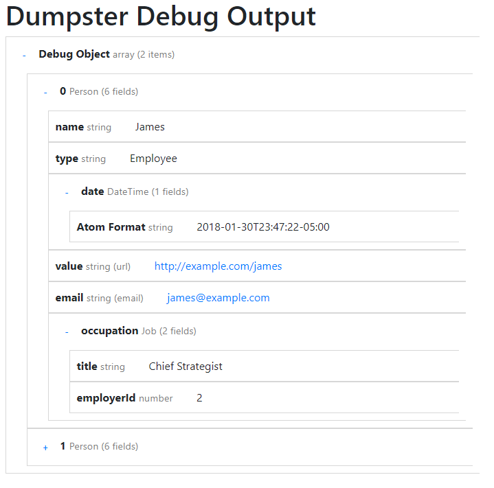

# dumpster

PHP Object Dump Utility. We all know the only way to debug your code is to step-through it with a debugger, like xdebug. Every now and then you end up in a situation where for some reason you can't and you have to fall back on your baser instincts and dump out object data. But var_dump and print_r can be ugly or overwhelming. That's where dumpster comes in.

While some may think that this was called dumpster because it dumps data out. Rather, it's named after a "dumpster fire", which is often what applications that use this method of debugging end up as. __Always use a real debugger if you can!__

## Object Dump Usage

You can dump the contents of an object simply by creating a dump object and performing output() on it. For example:

    $d = new \Dumpster\Dump($myDumpableObject);
    $d->output();

Or you can use the static facade to make things easier.

    \Dumpster\Dump::object($myDumpableObject);

This should work with all scalar, array, or object values.

Here is an example of what the output may look like:

## Environment-Level Dump Suppression

You can turn-off the Dumpster utility on an entire environment if the environment variable DUMPSTER_SUPPRESS is a non-zero value. This can help you avoid accidental debug dumps for an application in, for example, a production environment.

